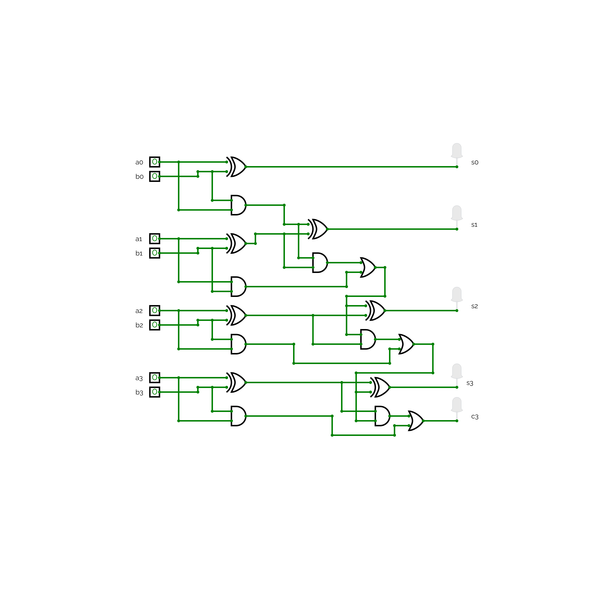

# Discrete 4-Bit Binary Adder (Breadboard Edition)

Ein von Grund auf diskret aufgebauter 4-Bit-Binäraddierer auf dem Breadboard, inspiriert durch die Hardware-Projekte von **Ben Eater**. Dieses Projekt demonstriert die fundamentale Funktionsweise von Computer-Arithmetik durch die physische Verschaltung einzelner Logikgatter der 74HC-Serie.

*Der fertige Aufbau auf dem Breadboard.*

## 🚀 Projektübersicht

Anstatt fertige Addierer-Chips zu verwenden, nutzt dieses Design grundlegende Logikgatter (XOR, AND, OR), um zu zeigen, wie ein Computer "denkt". Die Schaltung berechnet die Summe zweier 4-Bit-Zahlen (A und B) und gibt das Ergebnis über fünf LEDs aus.

### Kernmerkmale:
* **Ripple Carry Architektur:** Der Übertrag (Carry) wandert sequenziell durch jede Bit-Stufe.
* [cite_start]**Hybrid-Design:** Bestehend aus einem Half Adder für das niederwertigste Bit (LSB) und drei Full Adder Stufen.
* [cite_start]**Interaktiv:** Eingabe über DIP-Switches, Ausgabe über LEDs[cite: 1].

---

## 📐 Logische Schaltung

Die Schaltung wurde vorab in **CircuitVerse** simuliert. [cite_start]Sie besteht aus insgesamt 7 XOR-Gattern, 7 AND-Gattern und 3 OR-Gattern.

> **Tipp:** Du findest die zugehörige Simulationsdatei `4_bit_full_adder.cv` ebenfalls hier im Repository. Diese kannst du bei [CircuitVerse](https://circuitverse.org/) importieren.

---

## 📊 Wahrheitstabelle (Testfälle)

| Zahl A (a3-a0) | Zahl B (b3-b0) | Übertrag (c3) | Summe (s3-s0) | Ergebnis (Dez) |
| :--- | :--- | :--- | :--- | :--- |
| `0001` (1) | `0001` (1) | `0` | `0010` | 2 |
| `0011` (3) | `0001` (1) | `0` | `0100` | 4 |
| `0111` (7) | `0001` (1) | `0` | `1000` | 8 |
| `1111` (15) | `0001` (1) | `1` | `0000` | 16 (Overflow) |

---

## 🛠 Hardware & Stückliste (BOM)

Das Projekt wird über **USB-Power (5V)** versorgt.

| Komponente | Menge | Funktion |
| :--- | :--- | :--- |
| **74HC86** | 2 | Quad XOR-Gatter (Summenbildung) |
| **74HC08** | 2 | Quad AND-Gatter (Carry-Logik) |
| **74HC32** | 1 | Quad OR-Gatter (Carry-Zusammenführung) |
| **DIP-Schalter** | 2 | 4-polig, Eingabe für Zahl A und B |
| **LEDs** | 5 | [cite_start]Anzeige für s0, s1, s2, s3 und c3 |
| **Widerstände** | 8 | 10k Ohm (Pull-Down für Schalter) |
| **Widerstände** | 5 | 440 Ohm (Vorwiderstände für LEDs) |
| **Draht** | - | 0,5mm Starrdraht (farblich sortiert) |

---

## 💡 Aufbau-Hinweise

1. **Pull-Downs:** Die 10k Ohm Widerstände verhindern "schwebende" Eingänge an den Gattern.
2. **Kabelführung:** Die rechtwinklige Verkabelung (Ben Eater Style) sieht nicht nur gut aus, sondern hilft massiv bei der Fehlersuche.
3. **Logik-Pegel:** Achte darauf, dass alle ungenutzten Eingänge der CMOS-Gatter (74HC) auf GND oder VCC liegen, um Instabilitäten zu vermeiden.

---
*Inspired by Ben Eater*
